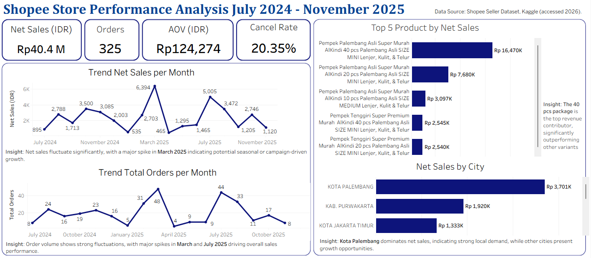

# shopee-sales-dashboard
End-to-end e-commerce sales performance analysis using SQL and Tableau.

## About me
Hi, I'm Umi Kalsum Patty
Industrial Engineering graduate transitioning career into Data Analytics.
Currently building practical experience through SQL-based analysis, data cleaning, and business performance projects.

## Portofolio Overview
This portfolio project showcases my ability to perform end-to-end data analysis, starting from data preparation and transformation using SQL to generating business insights through Tableau visualization. The main objective of this project is to support my application for a Data Analyst or Business Intelligence Analyst role.

Through this analysis, I demonstrate strong SQL skills for data cleaning and KPI calculation, business-oriented thinking in evaluating sales performance, and the ability to translate data into clear, actionable insights.

## Dashboard Preview

This dashboard presents key metrics such as Total Net Sales, Total Orders, and Return Rate to evaluate store performance.

## Key Metrics
The following KPIs were used to evaluate store performance:
- Total Net Sales  
- Average Order Value (AOV)  
- Total Orders 
- Cancelled Rate  

## Data Cleaning
Data cleaning was conducted using Excel and SQL to ensure the dataset was structured and analysis-ready. Numeric columns such as prices, quantities, discounts, shipping costs, and payment totals were standardized into proper number formats to enable accurate aggregation. Product weight values were also converted from text format (e.g., “865 gr”) into numeric format.

Text-based fields including product name, buyer information, and location details were maintained as TEXT data types during SQL import to preserve data integrity. Date and time columns were transformed into proper timestamp formats to support time-based analysis and prevent data type errors. Duplicate checks were performed to ensure order-level consistency before KPI calculation and dashboard development.

## Data Preparation
Relevant columns were selected to support KPI analysis, including order details, product information, location, order status, quantity, and return data. Time dimensions (order date, month, and year) were derived from the order timestamp to enable trend analysis. Calculated fields such as Net Sales, Gross Sales, and Total Discount were created in SQL to measure revenue performance and discount impact before dashboard development.

## Exploratory Data Analysis (EDA)
Exploratory analysis was performed to examine sales trends over time, geographic revenue distribution by city, and transaction outcomes based on order status and cancellation reasons. Return quantities and discount components were analyzed to evaluate their impact on net sales performance.

## Business Insights

- Sales performance from July 2024 to November 2025 shows noticeable fluctuations in monthly trends, as reflected in the dashboard. This pattern indicates the need for further analysis to identify the underlying drivers, such as seasonality, promotional campaigns, or operational factors.
- Seller-funded discounts contribute significantly to gross sales generation; however, they directly reduce net sales margins. A deeper evaluation of discount effectiveness is required to ensure profitability is maintained.
- The cancellation rate impacts realized revenue performance. Further investigation is necessary to understand the root causes of cancellations, whether driven by stock availability, fulfillment delays, pricing competitiveness, or customer behavior.
- Revenue contribution is concentrated in certain cities, suggesting potential opportunities for targeted marketing strategies and regional performance optimization.
Overall, this analysis serves as a foundation for deeper business diagnostics and strategic decision-making.

## Project Resources
- SQL Queries:
- Tableu Dashboard

## Tools User
- PostgreSQL (SQL) – Data extraction, transformation, and KPI calculation
- Microsoft Excel – Data cleaning and format standardization
- Tableau – Interactive dashboard development and visualization
- GitHub – Project documentation and version control

